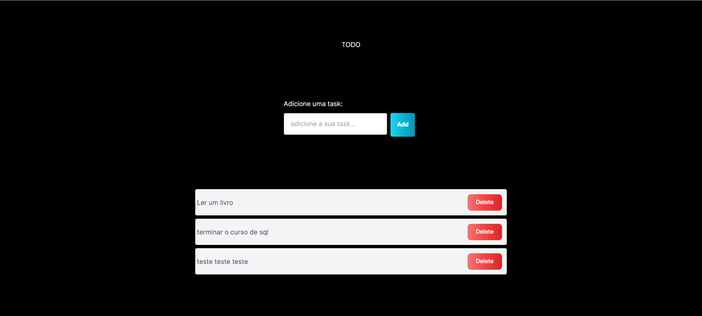

First, run the development server:

```bash
***** Instale as dependências *****
yarn
# or
npm i

***** run server *****
npm run dev
# or
yarn dev
# or
pnpm dev
# or
bun dev
```

### Tecnologias usadas nesse projeto:

- TypeScript
- React
- Next - versão apartir da 13
- Tailwind
- Vercel
- Sql

#### confirguração do next com a vercel:

crie um arquivo `.env` e coloque os seguintes comando:
crie uma conta na vercel e crie um database com o postrgres

```
POSTGRES_URL=
POSTGRES_URL_NON_POOLING=
POSTGRES_USER=
POSTGRES_HOST=
POSTGRES_PASSWORD=
POSTGRES_DATABASE=
```

## Projeto:

<h1 align="center">
  
</h1>

## documentação:

https://nextjs.org/docs/app/building-your-application/data-fetching/server-actions-and-mutations

https://nextjs.org/blog/next-14
